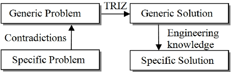
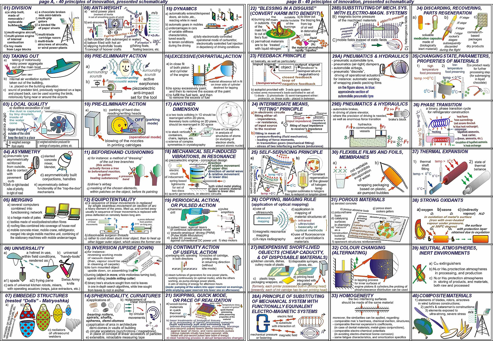
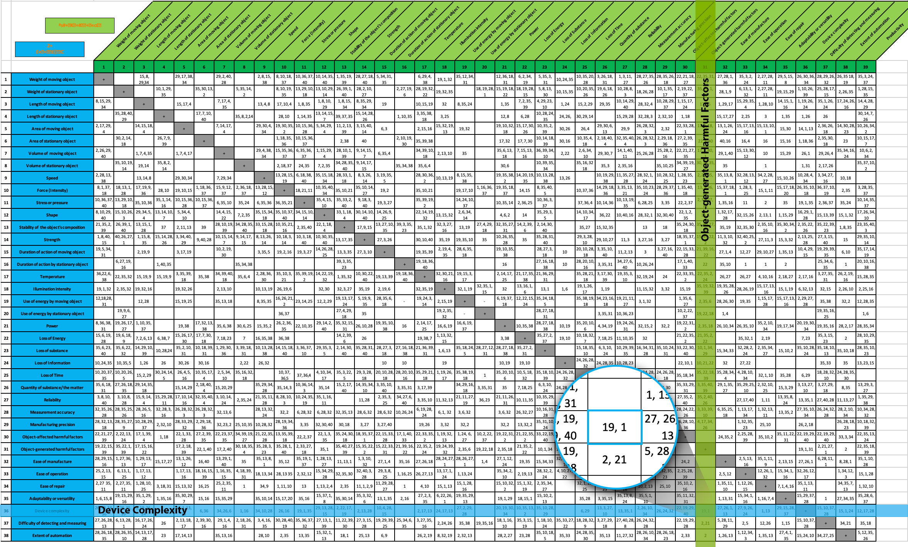

Introduction to TRIZ (Theory of Inventive Problem Solving)
==========================================================

Contemporary descriptions of TRIZ indicate that it extends beyond being merely a theory or a set of principles as its name
suggests. TRIZ is a knowledge-based systematic methodology of inventive problem solving (Savranksy, 2000). Fey and Rivin
(2005) described TRIZ as a methodology for the effective development of new [technical] systems, in addition to it being a set of
principles that describe how technologies and systems evolve.
Also, it has been described by Gadd (2011) as a toolkit consisting of methods which cover all aspects of problem understanding and
solving. This toolkit is regarded by some as the most comprehensive, systematically organised for invention and creative thinking
methodology known to man (Livotov, 2008).
TRIZ rests on the premise that technology evolution and the way to invention is not a random process, but is predictable and
governed by certain laws (Souchkov, 1997; Eversheim, 2009). It ison analytical logic and a systematic way of thinking (Souchkov,
1997; Savranksy, 2000). This systematic approach provides anoverall structure for the application of the collection of TRIZ tools
and techniques.
Even though the TRIZ has been described in various ways– a methodology, a toolkit, a science (Barry et al., 2006), a philosophy
(Nakagawa, 2001), etc., and this has the potential of creating confusion on what it actually is, what it is said to be capable of
achieving remains unanimously clear. It provides a systematicapproach for finding solutions to technical problems and innovating technical systems.

How does it work ?
------------------

TRIZ possesses considerable advantage over other methods applied to problem solving and innovation. Methods such as
brainstorming, mind mapping, lateral thinking, morphological analysis, etc., have the ability to identify or uncover a problem
and its root cause, but lack the capability to actually point out solutions to the problem. On the other hand, TRIZ helps to identify
problems and offers direct solutions to them, along with confidence that most (if not all) possible new solutions to the
problem have been considered (Gadd, 2011).

Main tools and techniques in TRIZ
---------------------------------
Several tools and techniques were developed by Altshuller and his colleagues in the advancement of TRIZ (Souchkov (2008)
provides a concise overview and timeline of the development of TRIZ tools and concepts from 1946–2008). The ones which appear
most prominent include :
– 40 inventive principles—conceptual solutions to technical and physical contradictions.
– 76 Standard solutions—for solving system problems without the need of identifying contradictions. They are usually
applied to correct the undesired interaction between two parts of a system.
– Effects database—which includes about 2500 concepts extracted from the body of engineering and scientific knowledge 
and applied to problem solving.
– Separation principles—for understanding and solving physical contradictions and points at solutions from the inventive
principles relevant to the problem.
– Contradiction matrix—a matrix of 39 technical parameters that are arranged on the vertical and horizontal axis to interact
with one another. It is used to point out the inventive principles that can be applied to solve technical contradiction.

