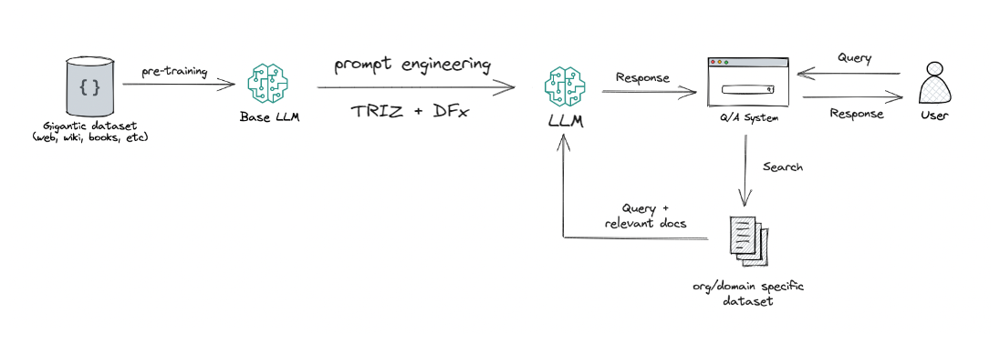

Product Design Assistant 
=========================
featuring LLMs , TRIZ and DFx methodologies
-------------------------------------------
This documentation provides a comprehensive overview of the integration of Large Language Models (LLMs) with TRIZ
(Theory of Inventive Problem Solving) and DFX (Design for X) methodologies. The project aims to leverage
the advanced natural language processing capabilities of LLMs to enhance innovation processes and optimize 
product designs across various criteria including cost, performance, and manufacturability. By synthesizing 
the principles of TRIZ and the flexibility of DFX approaches, the project explores how AI can drive creative 
solutions and streamline design processes in engineering and product development.

Contents
--------

.. toctree::
   :maxdepth: 3
   :caption: Intorduction
   
   docs/source/introduction/LLMs_with_TRIZ_and_DFX.rst
   docs/source/introduction/overview_of_the_project.rst

.. toctree::
   :maxdepth: 3
   :caption: Background

   docs/source/background/LLMs.rst
   docs/source/background/TRIZ.rst
   docs/source/background/DFx.rst

  
   

   

